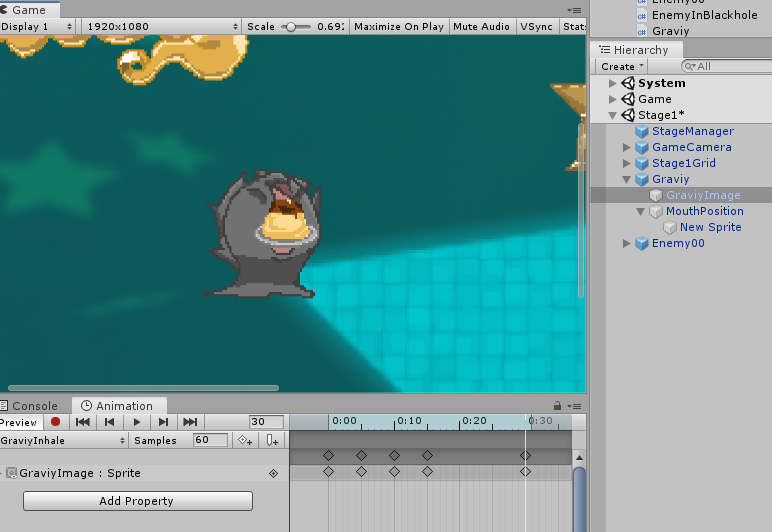

# スイーツを食べる
敵を吸い込んでスイーツに変化させて、ぐらびぃに触れさせると食べることができる。この処理を実装する。

## 仕様を整理
Graviyの冒頭で少し検討したが、改めて、食べる処理についてまとめる。

- アイテムがぐらびぃにぶつかったら食べる処理開始
  - アイテムの当たり判定をなくす
  - アイテムが、プレイヤーまで指定の秒数で辿り着くように設定
  - ぐらびぃの食べフラグをtrueにして、アニメ開始＆食べアニメ速度を1にする
- 食べているアニメ中、操作は通常通り
- 目的のアイテムがぐらびぃの口までたどり着いたら食べる処理完了
  - アイテムを消す
  - エネルギー回復
  - アニメの食べアニメを逆再生開始
- 食べている間にダメージを受けたら
  - 食べ中のアイテムを解放
  - 食べ状態解除
  - 食べるアニメからダメージアニメへ
- 食べアニメ中で、再生が逆再生の時、スタート時間に戻っていたら、食べ終了

## パラメーターの検討
- 移動自体に変化はないので、食べているかどうかはboolの`isEating`で管理
- 食べているアイテムは、`eatingObjects`でインスタンスを保有して、数は`eatingCount`で管理する
- アイテムが目的地に到達したら、アイテムから`Graviy.EatDone(this)`を呼び出す
- 途中でダメージを受けてアイテムを放出するために、アイテムに`ReleaseEat()`メソッドを実装

# 口の位置を調整
吸い込む先の口元の座標はぐらびぃの中心座標とは異なるので、別途設定する。ぐらびぃのオブジェクトの子供にスプライトオブジェクトを作成して、何らかの画像を設定する。ぐらびぃのAnimatorを持ったオブジェクトをHierarchyウィンドウで選んで、Animationウィンドウで食べる時のアニメに切り替えると、口を開いた時の位置がわかる。それを見ながら、口元の座標を調整する。



位置の調整が終わったら、スプライトは無効にするか削除して消して、口の位置を示すMouthPositionオブジェクトだけ残す。このオブジェクトの座標をスクリプトで参照して、アイテムはその座標を目指して移動するようにする。

## 2Dの注意!!
3Dなら、実際にオブジェクトを回転させて左右の向きを変えるので、子オブジェクトの位置はどこを向いても保たれる。しかし、2Dの場合は画像をフリップして見た目を変えるだけなので、子オブジェクトを右向きに調整したなら右向きの位置のままになってしまう。よって、これを利用する際には、作成したMouthPositionのローカル座標を記録しておいて、向いている方向に応じてXを加えるか引くかの切り替えが必要になる。

左右2パターンのみなので、あらかじめ左用と右用のオフセット値を計算しておいて、スプライトの状態に応じて現在座標にオフセット値を足したものを返すようにした。以下、実装の概要。

### 変数定義
以下をGraviy.csのインスタンス変数として定義。

```cs
static Vector3 mouthOffsetLeft = Vector3.zero;
static Vector3 mouthOffsetRight = Vector3.zero;

public static Vector3 MouthPosition
{
    get
    {
        return spRenderer.flipX ?
            instance.transform.position + mouthOffsetLeft:
            instance.transform.position + mouthOffsetRight;
    }
}
```

### Awake()の中でオフセット値を算出
以下、Awake()の中に追加

```cs
mouthOffsetRight = transform.Find("MouthPosition").transform.localPosition;
mouthOffsetLeft.Set(-mouthOffsetRight.x, mouthOffsetRight.y, 0);
```

あとは、利用したいアイテムの処理から、`Graviy.MouthPosition`を呼べば、現在の向いている方向に合わせた口元の座標が得られる。


# アイテムの処理の実装
## レイヤーの設定
アイテムは、ぐらびぃと同様で壁にぶつかって欲しいのでTriggerにはできない。しかし、ぐらびぃがアイテムを吸い込みはじめたら、ぐらびぃとアイテムの当たり判定をなくしたい。ただし、壁の判定は残したい。

以上を実現するために、通常時と吸い込み始めた時でアイテムのレイヤーを切り替えるようにする。通常時はプレイヤーとの当たり判定があるItemレイヤーを設定して、衝突を判定できるようにしておく。衝突が発生したら、アイテムの吸い込み処理を開始すると同時に、レイヤーをEatingItemレイヤーに切り替える。このレイヤーは、ぐらびぃとの当たり判定をPhysics2Dの設定で外しておく。

ぐらびぃがダメージを受けたなどで吸い込みをキャンセルした場合は、Itemレイヤーに戻して、衝突を復活させる。ダメージ中は、プレイヤーは食べる処理をしないようにする。

以上のために、ItemとEatingItemレイヤーを登録して、Physics2Dの設定でPlayerとEatingItemの衝突を解除する。


## 変数
以下のような変数を定義した。

```cs
bool isEating = false;
float eatStartTime = 0;
float eatTime;
float eatMinTime;
Rigidbody2D rb = null;
```

`isEating`は、通常時と吸い込み中を分けるフラグ。これがfalseの時は何も処理しない。このフラグは、ぐらびぃの当たり判定から呼び出される`Eat()`メソッド内で`true`にする。このフラグがtrueになっていたら、FixedUpdate()の中で、ぐらびぃの口元に指定の秒数で移動するように処理する。

`eatStartTime`は、`Eat()`が呼ばれた時の`Time.time`を保存しておく。これにより、吸い込みを開始してからの経過秒数がわかるので、アイテムの移動先を求めるのに利用する。

`eatTime`は、食べ終えるまでの秒数。食べ始めてから、この秒数後に口元に届くようにアイテムを移動させる。この値はぐらびぃに定義しておいて、Eat()メソッドで渡すようにした。Item側に定数で宣言してもよいだろう。

`eatMinTime`は、ぐらびぃの移動によって、eatStartTimeより速く口元に届いた場合に、食べて構わない秒数を設定する。これを設定しないと、ぐらびぃが口を開くアニメの前にアイテムを食べてしまうことがあるため、食べて不自然じゃないアニメパターンになるまでは、食べ物を画面の残しておくためのもの。

`rb`は、アイテムにアタッチしていたRigidbody2Dをキャッシュしておくためのもの。

## 定数
以下のような定数を定義した。

```cs
/// <summary>
/// 食べたとみなす距離
/// </summary>
const float EatDistance = 0.015f;

const string ItemLayer = "Item";
const string EatingLayer = "EatingItem";
```

`EatDistance`は、食べたと判断する距離。`eatMinTime`が経過していて、口元とアイテムの距離がこの値以下の場合は、食べる処理を実行する。

`ItemLayer`は、アイテムの通常のレイヤー名。吸い込みをキャンセルした時に、当たり判定を元に戻すために利用する。

`EatingLayer`は、アイテムを吸い込み中に、ぐらびぃとアイテムが接触しないようにするためのレイヤーを指定するための名前。

## メソッド
- Awake()
  - rbにRigidbody2Dを取得するのと、isEatingをfalseにする
- FixedUpdate()
  - 最初に、isEatingがfalseの時は、returnする
  - 経過時間と、口への距離を算出して、食べる条件を満たしていたら、ぐらびぃの`EatDone`を呼び出し、Destroy(gameObject)で消す
  - 現在の座標から、口元の座標に向けて、経過時間から内分率を算出して、座標を求めてrb.velocityに移動速度を設定
- Eat(食べきる秒数, 食べてよい最小秒数)
  - ぐらびぃから呼び出す
  - isEatingをtrueにして、必要な変数を記録して、レイヤーをEatingLayerに切り替える
- ReleaseEat()
  - ぐらびぃがダメージを受けた時に呼び出す
  - isEatingをfalseにして、レイヤーをItemに戻す

以上。
