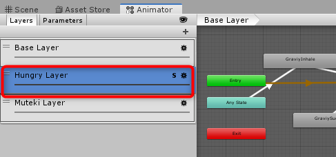

# エネルギーの実装
ぐらびぃのエネルギーを実装します。エネルギーは、ブラックホールの発生源です。これが尽きると、ブラックホールを発生させられなくなります。

# 仕様

## ルール
以下のようなルールです。

- 満タンからスタート
- ブラックホールを発生させると減っていく
- ブラックホールを発生させていないと少しずつ回復。空中と地上で回復量が違う
- 何か食べると復活する

## 実装する場所
[ブラックホール](Blackhole.md)の最後で議論しましたが、実装する場所はぐらびぃにします。

ブラックホールを作る時に、仮のものを定義していたので、それをぐらびぃに移動します。このパラメーターは、ゲームシステムで1つだけなので、staticで公開することで、どこからでも簡単に参照できるようにします。

エネルギーのUIは、その値を読み取って、自動的にパラメーターを反映するようにします。

以上、実装をします。

# 実装

## ぐらびぃに関連パラメーターを定義
Graviy.csを開いて定義を追加します。まずはエネルギーの増減を決めるパラメーターをSerializeFieldで定義します。

```cs
[Tooltip("ブラックホール発生時に、エネルギーを減らす秒速"), SerializeField]
float energySubBlackhole = -0.3f;
[Tooltip("着地時のエネルギーが回復秒速"), SerializeField]
float energyRecoveryOnGround = 0.3f;
[Tooltip("空中のエネルギー回復秒速"), SerializeField]
float energyRecoveryInTheAir = 0.1f;
[Tooltip("食べ物を食べた時に回復するエネルギー量"), SerializeField]
float energyFood = 0.5f;
```

エネルギーの最大値を定義しておきます。

```cs
/// <summary>
/// エネルギーの最大値
/// </summary>
public const float EnergyMax = 1f;
```

エネルギーを記録しておくプロパティを定義します。

```cs
/// <summary>
/// 現在のエネルギー。0が空。1が満タン。
/// </summary>
public static float Energy { get; private set; }
```

- `Awake()`に、エネルギーを満タンにする初期化を追加

```cs
Energy = EnergyMax;
```

## ブラックホールのエネルギーを書き換える
`Blackhole.cs`を開いて、仮に実装していた`energy`を、今定義したものに置き換えます。

- `float energy = 100f;`とした定義を削除
- エラーが発生した場所を、`Graviy.Energy`に書き換える

以上できたら、実行して問題なく今まで通り動作することを確認する。

# エネルギーの表示
エネルギーを表示するスクリプト、`EnergySlider`を作成して、エネルギー表示のスライドバーにアタッチする。

スクリプトは以下の通り。

```cs
using System.Collections;
using System.Collections.Generic;
using UnityEngine;
using UnityEngine.UI;

namespace HungraviyEx2019
{
    public class EnergySlider : MonoBehaviour
    {
        Slider energySlider = null;

        void Awake()
        {
            energySlider = GetComponent<Slider>();
        }

        private void LateUpdate()
        {
            energySlider.value = Graviy.Energy / Graviy.EnergyMax;
        }
    }
}
```

反映するのは、更新が終わったあとなので、LateUpdate()で描画直前に行うのがよいでしょう。

# エネルギー処理の追加
以下のルールに従って、Graviyスクリプトの`FixedUpdate`メソッド内に、コードを追加する。コードは自分で考えてみよう。

## ブラックホールが発生している時のエネルギー減
ブラックホールが発生している時、energySubBlackholeに経過秒数を掛けた値を、Energyに足す。

- FixedUpdate()1回分の経過秒数は、どのように取得すればよいか？

## ブラックホールが発生していない時の回復
ブラックホールを発生させていない時、下に地面があれば`energyRecoveryOnGround`、空中なら`energyRecoveryInTheAir`に、経過秒数を掛けた値をEnergyに足す。

地面に接触しているかどうかは、Enemy00.csで実装している。全く同じ処理が必要である。この時、以下のような2種類の実現方法が考えられる。

- 必要な変数や処理を、`Enemy00.cs`から、`Graviy.cs`にコピペする
- 必要な機能を、`OnGroundChecker.cs`のようなスクリプトに分離。MonoBehaviourは継承せずに、チェックしたい時に、Collider2Dのインスタンスを渡せば、着地しているかどうかをtrue/falseで返してくれるようにする

**同じコードは2回以上書きたくない**というのがプログラミングの原則なので、後者で実装するのが好ましい。どのように実装するかを示す。

- `OnGroundChecker`という名前でC#スクリプトを作成する
- このスクリプトは、ゲームオブジェクトにアタッチする必要はないので、クラス宣言の後ろの` : MonoBehaviour`を削除して、純粋なC#クラスにする。また、複数のインスタンスも不要なので、staticクラスにする
- 以下、実装コード

```cs
using UnityEngine;

public static class OnGroundChecker
{
    /// <summary>
    /// 衝突の上限数
    /// </summary>
    const int HitMax = 4;

    static ContactFilter2D contactFilter2D = new ContactFilter2D();
    static readonly ContactPoint2D[] contactPoints = new ContactPoint2D[HitMax];

    /// <summary>
    /// 渡したCollider2Dが着地したか(上向きのオブジェクトと接触したか)を確認して、
    /// 着地していたらtrue、そうでなければfalseを返します。
    /// </summary>
    /// <param name="col">チェックしたいCollider2D</param>
    /// <returns>true=着地 / false=空中</returns>
    public static bool Check(Collider2D col)
    {
        contactFilter2D.layerMask = LayerMask.GetMask("Map");

        // 着地チェック。上向きの接触があれば着地
        int hitCount = col.GetContacts(contactFilter2D, contactPoints);
        for (int i = 0; i < hitCount; i++)
        {
            if (contactPoints[i].normal.y >= 0.9f)
            {
                return true;
            }
        }

        return false;
    }
}
```

- 同時に接触する数はそれほど多くないことが予想されるので、8個にしておく
- Check()というstaticな公開メソッドを作成して、確認したコライダーを渡す。Collider2Dは、CircleCollider2DやBoxCollider2Dなど、2DのColliderをまとめて面倒をみることができる親クラス
- ほぼ、上向きのオブジェクトと接触していたら、着地しているとみなしてtrueを返して、接触していないか、1つも上向きのオブジェクトと接触していなければ、falseを返す

以上を作成したら、Enemy00.csをこのメソッドを使うように書き換える。

- 以下の宣言を削除
  - contactFilter2D
  - contactPoints
- Awake()内のcontactFilter2Dの行を削除
- UpdateMove()内の`if (onGround)`までを削除
- `if (onGround)`を、`if (OnGroundChecker.Check(capCollider))`に書き換え
- `hitCount`がエラーになるので、前に`var `を加える

以上できたら、Playして、問題なく動くか確認。

## あらためて、エネルギーの回復を実装
Enemy00と同様の使い方で、着地判定をして、着地していたらエネルギーを回復させる。

## エネルギーの減りすぎ、回復しすぎを制限
最後に、Mathf.Clamp()を使って、Energyが0～EnergyMaxの範囲に収まるようにする。

```cs
Energy = Mathf.Clamp(Energy, 0, EnergyMax);
```

# 空腹時のパターン切り替え
エネルギーが一定以下になったら、空腹アニメに切り替える。空腹アニメへの切り替えは、*Hungry Layer*の*Weight*を1にすることで実現する。



## 実装
`Graviy.cs`に、はらぺこに切り替える基準値を定義する。

```cs
[Tooltip("はらぺこ切り替えエネルギー"), SerializeField]
float hungryAnim = 0.33f;
```

`Energy`が`hungryAnim`より小さければはらぺこなので、レイヤーのウェイトを1に、そうでなければレイヤーのウェイトを0にすればよい。はらぺこレイヤーは1なので、以下をFixedUpdate()の最後に追加すればよい。

```cs

            // はらぺこアニメ切り替えチェック
            anim.SetLayerWeight(1, Energy < hungryAnim ? 1 : 0);
```

最後は、アイテムを取得した時の回復だが、これはアイテム取得を作成した時に実装する。エネルギーの実装は、一旦ここで完了。
