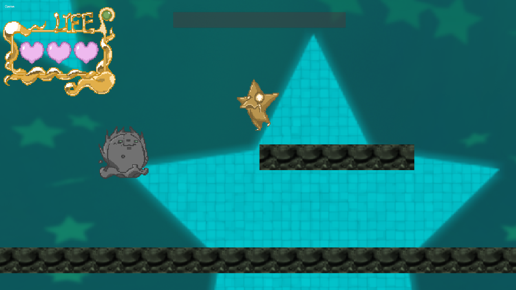

# モックアップ画面の作成
シーン遷移と同時に進めたいのが、モックアップ画面の作成です。

映画、アニメと同様、ゲームにとってもぱっと見での印象はとても大事です。作り込みを開始する前に、ぱっと見で魅力的に見える画面を模索して、方向付けをするのが吉です。

重要なのは、色味、UIのおおよそのレイアウト、キャラクターの大きさ、マップチップの大きさといったところです。画面に対して、キャラクターやマップの大きさがどれぐらいかを把握しておくことはとても大切です。これによって、テクスチャーやモデルをどの程度作り込む必要があるかが変わってきます。

この段階では、全ての要素を揃える必要はありません。プレイヤーをはじめとするゲームを構成する最低限の画像やモデルを用意して、1画面分でよいので完成のイメージ画像を作成します。これにより、キャラクターやマップの大きさを決めます。

この画面作りが出来れば、チーム全体でゲームの印象を共有することができ、プレイヤーや敵などのキャラクター、マップの仕掛けを作成して、置き換えていくことで開発を進めることができます。
