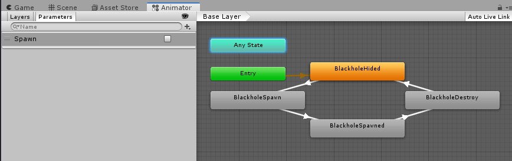
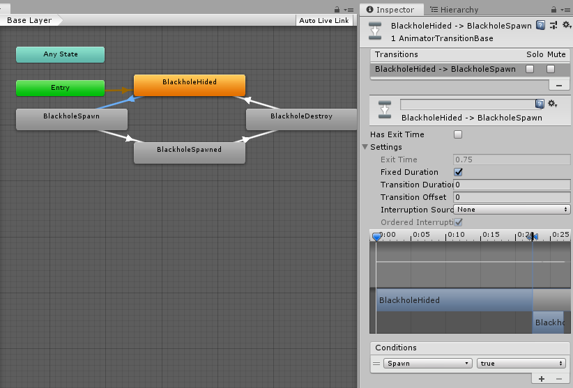
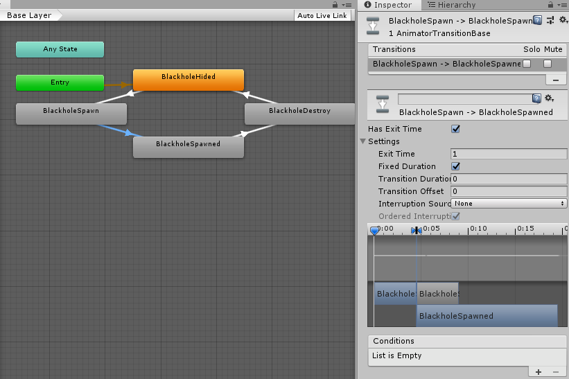
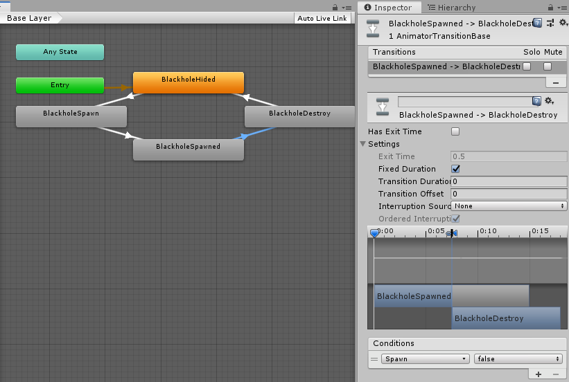
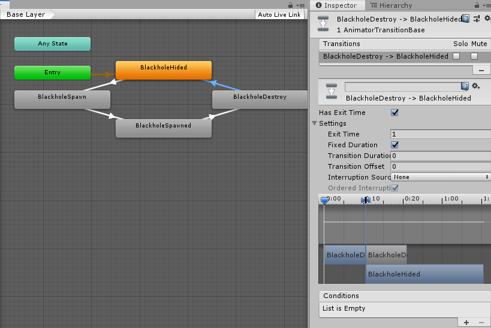

# プレイヤー

シーン遷移、モック画面ができたら、ゲームの中身の開発を開始します。

真っ先に手を付けたいのは、ゲームの要となるプレイヤーの操作です。チーム開発なら、ステージの作成、敵の作成、マップの仕掛けの作成も始められます。以下の流れと同様に検討して、進めていくとよいでしょう。

## 仕様を決める
コードを書く前に作るものの詳細を決めます。プログラミング慣れしている人は、ある程度の内容であればいきなり開発を始めても完成させることができます。しかし、それは暗算と同じことなので頭の中でまとめられる範囲のものにしか対応できません。暗算より筆算の方がはるかに複雑な問題を解くことができるのと同様で、これから作ろうとしているものを書き出すことで、様々なプログラミング的な課題に対応できるようになります。

### 操作方法
操作方法をまとめます。

- マウスのボタンを押すと、マウスカーソルの場所にブラックホールが発生する
- ドラッグで、ブラックホールはマウスカーソルの場所を目指して移動
- マウスのボタンを離すと、ブラックホールは消滅
- ESCキーでゲームを一時停止

操作を書き出すと分かりますが、主人公はぐらびぃですが、操作するのはブラックホールです。ブラックホールから先に作った方が合理的です。

### ブラックホールの状態を決める
ゲームの状況によって、操作と動きが切り替わることがあります。そのような動きを作りやすくするために、ゲーム中にどのような状態があるかを決めて、変数などで管理するのが一般的です。状態を切り替えることを**状態遷移**(じょうたいせんい)と呼びます。状態を英語でいうと**State**(ステート)です。状態を切り替えながら動作する仕組みのことを**State Machine**(ステートマシーン)といいます。UnityのAnimatorはState Machineです。

まずは、ゲームがスタートしてからの流れでどのようなことがブラックホールに起き得るかをリストアップします。

- ステージシーンがフェードイン。Go!の文字が表示されるまで操作不可
- Go!の表示後、何もしないとそのまま待機
- マウスボタンを押すと、ブラックホール発生
- エネルギーがなくなると消える
- マウスの操作で動く
- マウスのボタンを離すと消える
- クリアすると消える
- ゲームオーバーになるとそのままの状態で操作不可
- ポーズ中はそのままの状態で操作不可

以上から、状態を切り分けます。操作と動きを基準に検討していきます。

- 操作不能状態
  - Go!が開始される前
  - ゲームオーバー
  - クリア
  - ポーズ中
- ブラックホールが発生していない状態
  - 操作可能で、ボタンが押されていない
  - エネルギーがない
- ブラックホール発生中
  - 操作可能で、ボタンが押されている
  - エネルギーが残っている

状態はかなりシンプルです。

- 操作が可能な時にtrueを返すboolフラグ
- エネルギーの値
- マウスのボタンが押されているかどうか

以上の3つのパラメーターで制御できそうです。この程度の数ならば、パラメーターで直接制御した方がシンプルに実装できそうです。

状態が数種類以上あり、お互いの遷移が複雑な場合はフラグを個別にチェックする方法だと複雑さが増して制御が難しくなります。その場合は、enumなどで状態を宣言して、状態を切り替えて制御します。

### アニメーションの状態を決める
UnityのAnimatorコントローラーを活用する場合は、アニメーションの状態も決めます。

- 何も発生していない
- ブラックホールが発生するアニメ
- ブラックホールが出続けているアニメ
- ブラックホールが消えるアニメ

上記の4つの状態があります。これが切り替わるきっかけが何かを決めます。

- 何も発生していない
  - 発生する指示があったら発生へ
- ブラックホールが発生するアニメ
  - アニメの再生が終わったら自動的に、出続けているアニメへ
- ブラックホールが出続けているアニメ
  - 発生する指示がなくなったら、消えるアニメへ
- ブラックホールが消えるアニメ
  - アニメの再生が終わったら自動的に、何も発生していない状態へ

ここで気にしておきたいのが、ブラックホールが発生途中でボタンが離されたらどうなるのか。その逆の、ブラックホールが消えるアニメ中にまた発生するとどうなるのか。この2点です。

ブラックホールが発生中でもそのまま消えるアニメに移行させる方法と、発生するアニメが完了するのを待ってから消し始める2通りが考えられます。前者の方がテキパキ動きますが、アニメの途中から他のアニメに自然につなぐのは2Dではどこまで再生したのかの管理が必要なので工数が増えます。

詳細を詰めていくと、このような動かし方の違いが出てきます。その場合、まずは工数が少ない方で実装してみるのが良策です。動かしてみて問題がなければ、余計な工数をかけなくて済んだことになります。勿論、やはり駄目だね、となる場合もあります。その場合でも、無駄になる工数は少ないのでリスクを減らせます。

以上から、アニメを終えてから切り替えれる方法でまずは実装します。必要なパラメーターは、ブラックホールが発生しているかどうかのbool値だけです。trueなら、何も発生していない状態からブラックホール発生アニメに切り替え、falseなら、出続けているアニメから消えるアニメに切り替えます。

# アニメーションを作る
開発は、出力から作ると楽です。TDD(Test Driven Development)というのがありますが、考え方は同様です。目指すゴールから作っていく訳です。今回はアニメーション画像があるので、アニメ部分から作るのがよいでしょう。

## Animatorの作成
Projectウィンドウで*Create* > *Animator Controller*を作成して、`Blackhole`などの名前にします。既存のテスト用のものがあったら、削除して作り直します。

パラメーターは、*bool*型で、名前は`Spawn`としました。状態は以下のように作成しました。

トランザクションは以下の通りです。

### HidedからSpawn

- Has Exit Timeのチェックを外す
- Transition Durationを0
- ConditionsをSpawn、true設定

### SpawnからSpawned

- Has Exit Timeにチェック
- Exit Timeを1
- Transaction Durationを0

### SpawnedからDestroy

- Has Exit Timeのチェックを外す
- Transition Durationを0
- ConditionsをSpawn、false設定

### DestroyからHided

- Has Exit Timeにチェック
- Exit Timeを1
- Transaction Durationを0

## 動作確認
動きを確認します。

- Systemシーンをダブルクリックして開いたらPlayします
- Titleでクリックしてゲームを開始します
- HierarchyウィンドウでBlackholeオブジェクトをクリックして選択します
- WindowメニューからAnimation > Animatorを選択して、Animatorウィンドウを開きます

Blackholeのアニメは、最初はBlackholeHidedになるので、ブラックホールは表示されていません。

- AnimatorウィンドウでParametersタブを選択します
- Spawnにチェックを入れます

アニメーションの動きを確認できます。チェックを外すと、消えるアニメーションが再生されます。

# 操作を実装する
操作を実装します。

## プレハブの準備
Blackholeのプレハブに以下を設定ます。

- 新規にBlackholeというスクリプトを作成してアタッチ
- Rigidbody2Dをアタッチして、以下を設定
  - Gravity Scaleを0にして重力を消す
- Circle Collider 2Dをアタッチして、以下を設定
  - Is Triggerにチェック
- TagとLayerにBlackholeを定義して設定

## スクリプトの実装

### 変数やプロパティーの宣言
先にまとめた状態をはじめ、必要な変数やプロパティーを宣言します。

- Rigidbody2DとAnimatorのインスタンスをキャッシュする変数
- 操作が可能な時にtrueを返すboolフラグ`CanMove`
- エネルギーの値`Energy`。とりあえず100で初期化しておく
- 後程、ぐらびぃで利用するためのブラックホールの発生状態を表すフラグ`IsSpawned`

Awake()で、Rigidbody2DとAnimatorのインスタンスを取得します。

### 発生と解消を実装
処理の実装をしていきます。移動はRigidbody2Dで行うので、`FixedUpdate()`に実装します。マウスの入力の更新はUpdate()のサイクルで行われますが、今回のゲームでは、マウスのボタンは押しっぱなしにするか、離すかのみがゲームに影響します。クリックを取り逃してはいけない場合はUpdate()でマウスボタンの記録を行うべきですが、今回はその必要はないので、入力もFixedUpdate()に実装していまします。

FixedUpdateに以下の処理を実装します。

- CanMoveがfalseだったら、returnして以降の処理をしない
- マウスがクリックされていて、かつ、エネルギーが残っていたら発生フラグ`IsSpawn`をtruen、条件が不成立ならfalseに
- IsSpawnの値を、アニメーターの`Spawn`パラメーターに設定

以上で、マウスのボタンを押すとブラックホールが発生し、離すと消える処理が完了です。

フラグやエネルギーの判定を入れたので、データの処理をすればすぐに制約が働くようになります。

## 描画順位を整える
デフォルトだと、マップとブラックホールの優先順位が同じなので、マップに隠れたり隠れなかったりが不安定になります。優先順位は、Sprite RendererのSorting Layerか、Order in Layerで設定します。一般的には、種類ごとにSorting Layerで優先順位を設定した上で、同じレイヤー内の優先順位をOrder in Layerで設定します。

アイテム(Item)、ぐらびぃ(Graviy)、敵(Enemy)、ブラックホール(Blackhole)、マップ(Map)のSorting Layerを定義して、以下の通り優先順位を設定しておきます。HierarchyウィンドウでBlackholeオブジェクトを選択したら、InspectorウィンドウのSprite RendererのにあるSorting Layerで設定します。

優先順位は自由に設定して構いません。参考までに、以下の並び順を示しておきます。並べるのはSoring Layersの設定は、上から優先順位の低い順です。

- Default < Map < Blackhole < Enemy < Graviy < Item

## マウスの移動
マウスのカーソル位置にブラックホールを移動する処理を実装します。これも移動実行時のマウス座標を使えばよいので、すべてFixedUpdate()内に実装します。

CanMoveがfalseの時や、マウスがクリックされていないときは動かす必要はありません。IsSpawnを算出してアニメを設定した下に、IsSpawnがfalseならreturnするコードを書いて、その下に実装します。移動処理の流れは以下の通りです。

- マウス座標からワールド座標を求めます
- Vector3 moveなどのローカル変数を宣言して、求めたワールド座標-transform.positionを代入して、移動量を求めます
- Vector3.ClampMagnitude(move/Time.fixedDeltaTime, speedMax)とすれば、最高速度で制限したベクトルを求められるので、その値をrb.velocityに代入

おおよそ以上で最低限の動きはします。あとは力量次第で工夫して動きを向上させてください。以下、ヒントです。

- BlackholeのRigidbody2DのLinear Dragを設定すると、クリックをやめた後の減速を調整できます
- アニメがSpawnとSpawnedの時はマウス移動を有効にして、それ以外の時はマウスの影響をなくすとよい。アニメの状況を確認するには、Animation Eventか、StateMachineBehaviourを利用するなどの方法がある
- 初回の発生時は、マウスの座標にブラックホールを移動させるとよい。あるいは、ブラックホールが発生していない間、マウスの座標にブラックホールを一致させる

以上で、ブラックホールの基本的な動きの実装は完了です。

# エネルギーの実装について
ブラックホールの発生源であるエネルギーの管理はどのようにすればよいでしょうか。エネルギーはあちこちに影響を与えるので、どこにデータを持たせるのがよいか検討します。

### ブラックホール関連
- 一定の残り量がないと、ブラックホールを発生させられない
- 残りが0になると、発生させていたブラックホールが消える
- 発生させていないと、少し回復

### ぐらびぃ関連
- 残りの量で、ぐらびぃの画像が切り替わる
- ぐらびぃがアイテムを取ると回復する

### UI
- 残りの量を、UIのバーで表示

値の変更があるオブジェクトに持たせるのがよいでしょう。UIはまず除外できます。

ブラックホールとぐらびぃは、どちらもエネルギーの増減に関わります。操作を実装したブラックホールに実装するという解釈もできますが、ゲームの設定としてはぐらびぃの行動力の源泉をパラメーターにしたのがエネルギーです。であれば、ぐらびぃに持たせるのが自然だと考えられます。

ぐらびぃに実装して、ブラックホールはその値を参照するようにします。以上から、エネルギーを実装する前に、ぐらびぃの実装をします。

[目次へ](../README.md)
